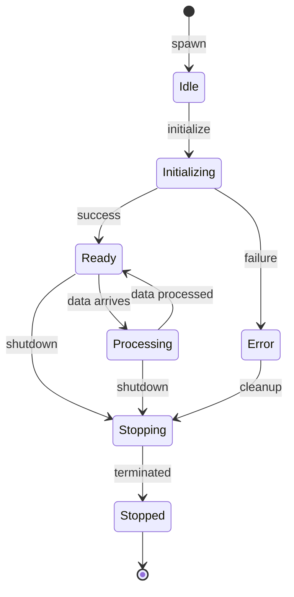
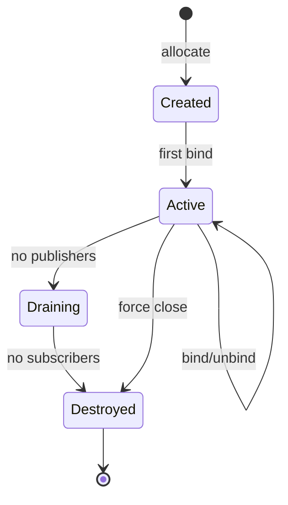

# Data Model

## Core Entities

### NodeProcess

Represents an isolated Python process executing a pipeline node.

```rust
struct NodeProcess {
    /// Unique process identifier
    process_id: u32,

    /// Node type identifier (e.g., "LFM2Audio", "VibeVoiceTTS")
    node_type: String,

    /// Current execution status
    status: ProcessStatus,

    /// Memory usage in bytes
    memory_usage: u64,

    /// Process start timestamp
    initialization_timestamp: SystemTime,

    /// IPC channel identifiers for communication
    input_channels: Vec<ChannelId>,
    output_channels: Vec<ChannelId>,

    /// Session this process belongs to
    session_id: String,

    /// Process handle for lifecycle management
    process_handle: Child,
}
```

**Lifecycle States**:
```rust
enum ProcessStatus {
    Idle,         // Process created but not initialized
    Initializing, // Loading models/resources
    Ready,        // Initialized and waiting for data
    Processing,   // Actively processing data
    Stopping,     // Graceful shutdown initiated
    Stopped,      // Process terminated
    Error(String), // Failed with error message
}
```

**Validation Rules**:
- `process_id` must be unique within the runtime
- `node_type` must match a registered node manifest
- Status transitions must follow: Idle → Initializing → Ready ↔ Processing → Stopping → Stopped
- Memory usage updated every status change
- Process handle must be valid for status != Stopped

### SharedMemoryChannel

Zero-copy communication pathway between processes.

```rust
struct SharedMemoryChannel {
    /// Unique channel identifier
    channel_id: ChannelId,

    /// Human-readable channel name
    channel_name: String,

    /// Maximum buffer capacity in bytes
    buffer_capacity: usize,

    /// Current data in buffer
    current_occupancy: usize,

    /// Number of publishers
    publisher_count: u32,

    /// Number of subscribers
    subscriber_count: u32,

    /// iceoryx2 service handle
    service: Service,

    /// Backpressure enabled flag
    backpressure_enabled: bool,
}
```

**Validation Rules**:
- `buffer_capacity` must be power of 2 for alignment
- `current_occupancy` <= `buffer_capacity`
- At least one publisher OR subscriber must exist
- Channel destroyed when both counts reach 0
- `backpressure_enabled` defaults to true

### RuntimeData

Structured message for inter-process data transfer.

```rust
struct RuntimeData {
    /// Fixed-size header
    header: DataHeader,

    /// Variable-size payload
    payload: Vec<u8>,
}

struct DataHeader {
    /// Data type discriminator
    data_type: DataType,

    /// Payload size in bytes
    payload_size: u32,

    /// Originating session
    session_id: String,

    /// Timestamp of data creation
    timestamp: SystemTime,

    /// Type-specific metadata
    metadata: DataMetadata,
}

enum DataType {
    Audio,
    Video,
    Text,
    Tensor,
}

enum DataMetadata {
    Audio {
        sample_rate: u32,      // Hz (e.g., 24000, 48000)
        channels: u16,         // 1 = mono, 2 = stereo
        format: AudioFormat,   // F32, I16, etc.
    },
    Video {
        width: u32,           // pixels
        height: u32,          // pixels
        format: VideoFormat,  // RGB, YUV, etc.
        fps: f32,            // frames per second
    },
    Text {
        encoding: String,     // "utf-8"
        language: Option<String>, // ISO 639-1 code
    },
    Tensor {
        shape: Vec<usize>,    // Dimension sizes
        dtype: TensorType,    // F32, I32, etc.
    },
}
```

**Validation Rules**:
- Header size fixed at 256 bytes for alignment
- `payload_size` must match actual payload length
- Audio samples must be contiguous in memory
- Video frames must include all color planes
- Tensor data must be C-contiguous layout
- Timestamp must be monotonically increasing within session

## Relationships

### Process-Channel Association

```rust
struct ProcessChannelBinding {
    process_id: u32,
    channel_id: ChannelId,
    role: ChannelRole,
    connected_at: SystemTime,
}

enum ChannelRole {
    Publisher,   // Process writes to channel
    Subscriber,  // Process reads from channel
}
```

**Invariants**:
- Process can publish to multiple channels
- Process can subscribe to multiple channels
- Cannot publish and subscribe to same channel
- Bindings cleared on process termination

### Session-Process Mapping

```rust
struct SessionProcessMap {
    session_id: String,
    process_ids: Vec<u32>,
    created_at: SystemTime,
    pipeline_config: PipelineConfig,
}

struct PipelineConfig {
    nodes: Vec<NodeConfig>,
    connections: Vec<Connection>,
    max_processes: Option<usize>,
}
```

**Invariants**:
- All processes in session terminated together
- Session owns process lifecycle
- Max processes enforced per deployment config
- Connections validated against node manifests

## State Transitions

### Process Lifecycle



### Channel Lifecycle

