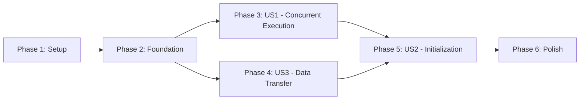

# Implementation Tasks: Multi-Process Node Execution

**Feature**: Multi-process Python nodes with independent GILs
**Branch**: `001-multiprocess-python-nodes`
**Generated**: 2025-11-04

## Summary

Enable concurrent execution of Python-based pipeline nodes using separate processes with iceoryx2 shared memory IPC.

**User Stories**:
- **US1** (P1): Run Multiple AI Models Concurrently - Core concurrent execution capability
- **US2** (P2): Fast Pipeline Initialization - Progress tracking and pre-loading
- **US3** (P1): Efficient Data Transfer Between Nodes - Zero-copy IPC implementation

**Total Tasks**: 42
**Parallelizable**: 18 tasks marked with [P]

## Phase 1: Project Setup

Initialize project structure and dependencies.

- [X] T001 Add iceoryx2 dependency to runtime/Cargo.toml with features = ["publish-subscribe"]
- [X] T002 Add pyo3 dependency to runtime/Cargo.toml with features = ["auto-initialize"]
- [X] T003 Create runtime/src/python module directory structure
- [X] T004 [P] Add multiprocess extras to python-client/setup.py dependencies
- [X] T005 [P] Create python-client/remotemedia.core/multiprocess directory structure

## Phase 2: Foundational Components

Core infrastructure required by all user stories.

- [X] T006 Implement NodeExecutor trait in runtime/src/python/multiprocess_executor.rs
- [X] T007 Create RuntimeData struct in runtime/src/python/data_transfer.rs with header and payload
- [X] T008 Implement iceoryx2 initialization in runtime/src/python/ipc_channel.rs
- [X] T009 [P] Create Python RuntimeData class in python-client/remotemedia.core/multiprocess/data.py
- [X] T010 [P] Implement MultiprocessNode base class in python-client/remotemedia.core/multiprocess/node.py

## Phase 3: User Story 1 - Run Multiple AI Models Concurrently (P1)

**Goal**: Enable concurrent execution of multiple Python nodes without GIL blocking.

**Independent Test**: Create pipeline with 2+ Python nodes and verify concurrent execution under 500ms latency.

### Implementation Tasks

- [X] T011 [US1] Implement ProcessManager in runtime/src/python/process_manager.rs
- [X] T012 [US1] Add spawn_node method in runtime/src/python/process_manager.rs
- [X] T013 [US1] Implement process lifecycle states in runtime/src/python/process_manager.rs
- [X] T014 [US1] Create ProcessHandle struct in runtime/src/python/process_manager.rs
- [X] T015 [P] [US1] Implement MultiprocessExecutor::execute_node in runtime/src/python/multiprocess_executor.rs
- [X] T016 [P] [US1] Add process monitoring with event-driven signals in runtime/src/python/health_monitor.rs
- [X] T017 [US1] Implement handle_process_exit for crash detection in runtime/src/python/health_monitor.rs
- [X] T018 [US1] Add pipeline termination on node failure in runtime/src/python/multiprocess_executor.rs
- [X] T019 [P] [US1] Create Python node runner script in python-client/remotemedia.core/multiprocess/runner.py
- [X] T020 [P] [US1] Implement node registration decorator in python-client/remotemedia.core/multiprocess/__init__.py
- [X] T021 [US1] Add concurrent execution test in runtime/tests/integration/multiprocess_test.rs
- [X] T022 [P] [US1] Create example concurrent pipeline in examples/multiprocess/concurrent_pipeline.rs

## Phase 4: User Story 3 - Efficient Data Transfer Between Nodes (P1)

**Goal**: Zero-copy data transfer with <1ms latency for large payloads.

**Independent Test**: Measure transfer latency for 1KB-10MB payloads, verify zero-copy behavior.

### Implementation Tasks

- [X] T023 [US3] Implement ChannelRegistry in runtime/src/python/ipc_channel.rs
- [X] T024 [US3] Add create_channel method with iceoryx2 service in runtime/src/python/ipc_channel.rs
- [X] T025 [US3] Implement zero-copy loan_uninit for writing in runtime/src/python/data_transfer.rs
- [X] T026 [US3] Add Publisher with backpressure support in runtime/src/python/ipc_channel.rs
- [X] T027 [US3] Add Subscriber with zero-copy receive in runtime/src/python/ipc_channel.rs
- [X] T028 [P] [US3] Implement Python Publisher class in python-client/remotemedia.core/multiprocess/channel.py
- [X] T029 [P] [US3] Implement Python Subscriber class in python-client/remotemedia.core/multiprocess/channel.py
- [X] T030 [US3] Add connect_nodes for channel binding in runtime/src/python/multiprocess_executor.rs
- [X] T031 [US3] Create latency benchmark in runtime/benches/ipc_latency.rs
- [X] T032 [P] [US3] Add zero-copy test in runtime/tests/test_ipc.rs

## Phase 5: User Story 2 - Fast Pipeline Initialization (P2)

**Goal**: Pipeline initialization with progress tracking, completing within 30s.

**Independent Test**: Measure init time for 3+ large models, verify progress updates every 2s.

### Implementation Tasks

- [X] T033 [US2] Implement SessionState management in runtime/src/python/multiprocess_executor.rs
- [X] T034 [US2] Add create_session method in runtime/src/python/multiprocess_executor.rs
- [X] T035 [US2] Implement wait_for_initialization with timeout in runtime/src/python/multiprocess_executor.rs
- [X] T036 [P] [US2] Add InitProgress struct and progress callbacks in runtime/src/python/multiprocess_executor.rs
- [X] T037 [P] [US2] Create Python Session class in python-client/remotemedia.core/multiprocess/session.py
- [X] T038 [P] [US2] Implement Pipeline builder in python-client/remotemedia.core/multiprocess/pipeline.py
- [X] T039 [US2] Add progress tracking test in runtime/tests/integration/multiprocess_test.rs
- [X] T040 [P] [US2] Create initialization example in examples/multiprocess/init_with_progress.py

## Phase 6: Polish & Cross-Cutting Concerns

Final integration, error handling, and documentation.

- [X] T041 Add configuration loading from runtime.toml in runtime/src/python/multiprocess_executor.rs
- [X] T042 Create integration test suite in runtime/tests/test_crash_recovery.rs

## Dependencies

### User Story Dependencies



**Execution Order**:
1. Phases 1-2 are sequential prerequisites
2. US1 and US3 can be developed in parallel after Phase 2
3. US2 depends on both US1 and US3 being complete
4. Polish phase requires all user stories complete

### Parallel Execution Opportunities

#### Phase 1 (Setup)
```bash
# Can run in parallel:
T004 & T005  # Python and Rust setup tasks
```

#### Phase 3 (US1 - Concurrent Execution)
```bash
# Can run in parallel after T011-T014:
T015 & T016 & T019 & T020  # Executor, monitoring, and Python components
T021 & T022  # Tests and examples
```

#### Phase 4 (US3 - Data Transfer)
```bash
# Can run in parallel after T023-T027:
T028 & T029 & T032  # Python bindings and tests
```

#### Phase 5 (US2 - Initialization)
```bash
# Can run in parallel after T033-T035:
T036 & T037 & T038 & T040  # Progress, Session, Pipeline, examples
```

## Implementation Strategy

### MVP Scope (Minimum Viable Product)
**Target**: Complete User Story 1 (Concurrent Execution) first
- Delivers core value: Multiple Python nodes running concurrently
- Unblocks real-time speech-to-speech use case
- Can be tested and validated independently
- Phases 1-3 only (22 tasks)

### Incremental Delivery
1. **Sprint 1**: Setup + Foundation (T001-T010) - Infrastructure ready
2. **Sprint 2**: US1 Concurrent Execution (T011-T022) - MVP complete
3. **Sprint 3**: US3 Data Transfer (T023-T032) - Performance optimization
4. **Sprint 4**: US2 Initialization (T033-T040) - UX improvements
5. **Sprint 5**: Polish (T041-T042) - Production ready

### Testing Strategy
Each user story includes independent test criteria:
- **US1**: Concurrent execution test with latency verification
- **US3**: Zero-copy transfer benchmark with various payload sizes
- **US2**: Initialization timing and progress tracking test

## Validation Checklist

- ✅ All 42 tasks follow checklist format: `- [ ] TaskID [P] [Story] Description`
- ✅ User story labels present for story-specific tasks (T011-T040)
- ✅ Parallel markers [P] for independent tasks (18 total)
- ✅ File paths specified in all implementation tasks
- ✅ Each user story has independent test criteria
- ✅ Dependencies clearly documented
- ✅ MVP scope identified (US1 only)