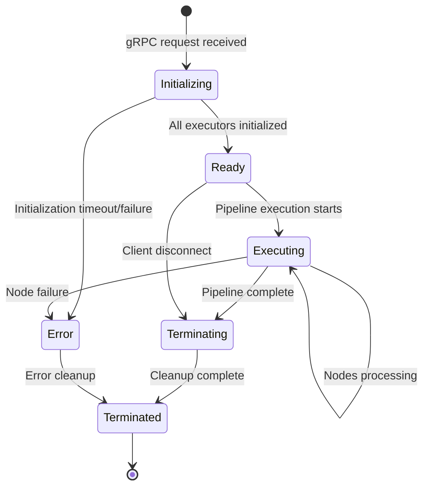
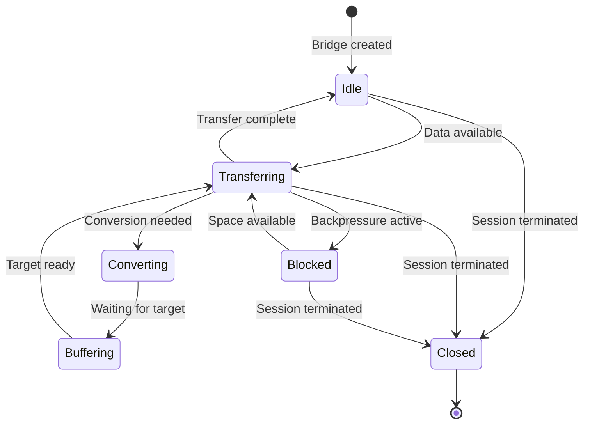

# Data Model

## Core Entities

### ExecutorRegistry

Maps node types to their appropriate executor implementations.

```rust
struct ExecutorRegistry {
    /// Explicit node type → executor mappings
    node_type_mappings: HashMap<String, ExecutorType>,

    /// Pattern matchers for dynamic routing
    pattern_rules: Vec<PatternRule>,

    /// Default executor for unmatched nodes
    default_executor: ExecutorType,

    /// Registry initialization timestamp
    created_at: SystemTime,
}

enum ExecutorType {
    Native,        // Rust native nodes (AudioChunkerNode, etc.)
    Multiprocess,  // Python nodes with independent GIL
    Wasm,          // WebAssembly nodes (future)
}

struct PatternRule {
    /// Regex or suffix pattern
    pattern: String,

    /// Executor to use for matches
    executor_type: ExecutorType,

    /// Priority (higher = checked first)
    priority: u32,
}
```

**Lifecycle**:
- Created once at service startup
- Populated with default mappings (Python nodes → Multiprocess)
- Can be extended via configuration
- Immutable after initialization

**Validation Rules**:
- Pattern rules must compile to valid regex
- No duplicate node_type mappings
- At least one default executor defined
- Priority values must be unique

---

### SessionExecutionContext

Tracks execution state for a specific gRPC session.

```rust
struct SessionExecutionContext {
    /// Unique session identifier
    session_id: String,

    /// Executor instances for this session
    executors: HashMap<ExecutorType, Box<dyn NodeExecutor>>,

    /// Node → executor mapping for this session
    node_assignments: HashMap<String, ExecutorType>,

    /// Inter-executor data channels
    data_bridges: Vec<DataBridge>,

    /// Session status
    status: SessionStatus,

    /// Creation timestamp
    created_at: Instant,

    /// Multiprocess configuration (if applicable)
    multiprocess_config: Option<MultiprocessConfig>,
}

enum SessionStatus {
    Initializing,
    Ready,
    Executing,
    Terminating,
    Terminated,
    Error(String),
}
```

**Lifecycle**:
- Created when gRPC client calls ExecutePipeline or StreamPipeline
- Executors initialized based on manifest node types
- Data bridges created for inter-executor connections
- Terminated when pipeline completes or client disconnects

**Validation Rules**:
- session_id must be unique within service
- All referenced executors must be initialized
- Data bridges must have valid source/target executors
- Status transitions must follow: Initializing → Ready → Executing → (Terminating → Terminated | Error)

---

### ManifestConfiguration

Parsed multiprocess configuration from manifest metadata.

```rust
struct ManifestConfiguration {
    /// Maximum processes for this session
    max_processes_per_session: Option<usize>,

    /// Channel capacity (messages per channel)
    channel_capacity: usize,

    /// Node initialization timeout (seconds)
    init_timeout_secs: u64,

    /// Python interpreter path
    python_executable: PathBuf,

    /// Enable backpressure on channels
    enable_backpressure: bool,

    /// Custom node type → executor mappings
    executor_overrides: HashMap<String, String>,
}
```

**Parsing**:
```json
{
  "version": "v1",
  "metadata": {
    "name": "my-pipeline",
    "multiprocess": {
      "max_processes_per_session": 10,
      "channel_capacity": 100,
      "init_timeout_secs": 30,
      "python_executable": "python",
      "enable_backpressure": true
    }
  },
  "nodes": [...],
  "connections": [...]
}
```

**Validation Rules**:
- max_processes_per_session must not exceed global limit
- channel_capacity must be > 0 and ≤ 10000
- init_timeout_secs must be > 0 and ≤ 300 (5 minutes)
- python_executable must be valid file path
- executor_overrides keys must match node IDs in manifest

---

### NodeExecutionPlan

Ordered sequence of nodes with assigned executors.

```rust
struct NodeExecutionPlan {
    /// Ordered list of execution stages
    stages: Vec<ExecutionStage>,

    /// Dependency graph for parallel execution
    dependency_graph: HashMap<String, Vec<String>>,

    /// Total estimated execution time (ms)
    estimated_duration_ms: u64,
}

struct ExecutionStage {
    /// Nodes that can execute in parallel at this stage
    nodes: Vec<NodeAssignment>,

    /// Stage number (0-indexed)
    stage_index: usize,
}

struct NodeAssignment {
    /// Node ID from manifest
    node_id: String,

    /// Node type
    node_type: String,

    /// Assigned executor
    executor: ExecutorType,

    /// Node configuration parameters
    params: serde_json::Value,
}
```

**Derivation**:
- Parsed from manifest connections (topological sort)
- Nodes with no dependencies execute in stage 0
- Subsequent stages wait for dependencies to complete
- Parallel nodes within same stage execute concurrently

**Validation Rules**:
- No circular dependencies
- All connection references must exist in nodes list
- Stage indices must be sequential
- At least one node must exist

---

### DataBridge

Handles data transfer between different executor types.

```rust
struct DataBridge {
    /// Source executor type
    source_executor: ExecutorType,

    /// Target executor type
    target_executor: ExecutorType,

    /// Conversion strategy
    conversion_strategy: ConversionStrategy,

    /// Internal buffer for data in transit
    buffer: Arc<RwLock<VecDeque<RuntimeData>>>,

    /// Metrics tracking
    bytes_transferred: AtomicU64,
    messages_transferred: AtomicU64,
    conversion_latency_us: AtomicU64,
}

enum ConversionStrategy {
    /// No conversion needed (same executor type)
    Direct,

    /// Native memory → Shared memory
    NativeToIPC,

    /// Shared memory → Native memory
    IPCToNative,

    /// Both executors use shared memory (zero-copy)
    SharedMemory,
}
```

**Lifecycle**:
- Created when manifest parsing detects inter-executor connections
- Active during pipeline execution
- Automatically cleaned up on session termination
- Metrics reset per execution

**Validation Rules**:
- Source and target executors must be initialized
- Buffer capacity must not exceed session limit
- Conversion strategy must match executor types

---

## Relationships

### Session → Executor Instances

```rust
struct SessionExecutorBinding {
    session_id: String,
    executor_type: ExecutorType,
    executor_instance: Arc<dyn NodeExecutor>,
    spawned_at: Instant,
}
```

**Invariants**:
- Each session has at most one instance per executor type
- Executors are shared within session, isolated between sessions
- Native executor always present, others conditional on node types
- Terminated sessions release all executor instances

### Node → Executor Assignment

```rust
struct NodeExecutorAssignment {
    node_id: String,
    node_type: String,
    executor_type: ExecutorType,
    assignment_reason: AssignmentReason,
}

enum AssignmentReason {
    ExplicitMapping,    // Configured in registry
    PatternMatch(String), // Matched via pattern rule
    Default,            // Fallback to default executor
}
```

**Invariants**:
- Each node assigned to exactly one executor
- Assignment immutable after session initialization
- All nodes in manifest must have assignments

### Executor → Data Bridges

```rust
struct ExecutorDataFlow {
    executor_type: ExecutorType,
    inbound_bridges: Vec<Arc<DataBridge>>,
    outbound_bridges: Vec<Arc<DataBridge>>,
}
```

**Invariants**:
- Each connection between executors has one data bridge
- Bridges are bidirectional for streaming pipelines
- Bridge count ≤ (num_executors * (num_executors - 1))

---

## State Transitions

### Session Lifecycle



### Executor Bridge State



---

## Data Flow Example

**Scenario**: Speech-to-speech pipeline with mixed executors

```text
[Native] AudioChunkerNode (Rust)
    ↓ (DataBridge: NativeToIPC)
[Multiprocess] WhisperNode (Python, Process 1)
    ↓ (DataBridge: SharedMemory - both multiprocess)
[Multiprocess] LFM2Node (Python, Process 2)
    ↓ (DataBridge: SharedMemory)
[Multiprocess] VibeVoiceNode (Python, Process 3)
    ↓ (DataBridge: IPCToNative)
[Native] AudioOutputNode (Rust)
```

**Data Conversions**:
1. AudioChunkerNode → WhisperNode: `Arc<AudioBuffer>` → `iceoryx2 sample`
2. WhisperNode → LFM2Node: Zero-copy (both use shared memory)
3. LFM2Node → VibeVoiceNode: Zero-copy (both use shared memory)
4. VibeVoiceNode → AudioOutputNode: `iceoryx2 sample` → `Arc<AudioBuffer>`

**Conversion Cost**:
- Native → IPC: ~1ms (memcpy audio buffer)
- IPC → IPC: ~10µs (reference update only)
- IPC → Native: ~1ms (memcpy audio buffer)
- Total: ~2ms per executor boundary hop
