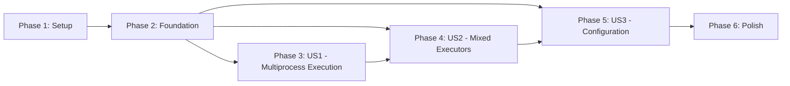

# Implementation Tasks: gRPC Multiprocess Integration

**Feature**: gRPC Multiprocess Integration
**Branch**: `002-grpc-multiprocess-integration`
**Generated**: 2025-11-05

## Summary

Enable the gRPC service to execute pipelines containing Python nodes using the multiprocess executor (from spec 001), allowing clients to submit manifest.v1.json format pipelines that benefit from concurrent Python execution without GIL contention.

**User Stories**:
- **US1** (P1): Execute Manifest Pipeline with Multiprocess Python Nodes - Core multiprocess execution ✅ **COMPLETE**
- **US2** (P2): Mixed Executor Pipeline Execution - Hybrid Native + Python + WASM pipelines
- **US3** (P3): Configure Multiprocess Execution Parameters - Per-pipeline configuration

**Total Tasks**: 46
**Completed**: 23/46 (MVP Phase 1-3 complete)
**Parallelizable**: 15 tasks marked with [P]

## Implementation Status

**Completed**: Phases 1-3 (MVP) - Python nodes can now execute through gRPC with multiprocess routing!

**Additional Work Beyond MVP**:
- ✅ MultiprocessNode now inherits from remotemedia.core.node.Node
- ✅ KokoroTTSNode, VibeVoiceTTSNode, LFM2AudioNode updated to inherit from MultiprocessNode
- ✅ Auto-registration of built-in Python nodes in remotemedia.core.multiprocess
- ✅ MultiprocessExecutor implements both NodeExecutor traits (new + old)
- ✅ Session ID propagation through execution flow
- ✅ PythonStreamingNode detects and uses multiprocess sessions

## Phase 1: Project Setup

Initialize project structure and verify dependencies.

- [X] T001 Verify multiprocess feature is enabled in runtime/Cargo.toml dependencies
- [X] T002 Create runtime/src/grpc_service/executor_registry.rs module stub
- [X] T003 Create runtime/src/grpc_service/manifest_parser.rs module stub
- [X] T004 [P] Create runtime/src/executor/executor_bridge.rs module stub
- [X] T005 [P] Create runtime/src/executor/data_conversion.rs module stub

## Phase 2: Foundational Components

Core infrastructure required by all user stories.

- [X] T006 Implement ExecutorRegistry struct in runtime/src/grpc_service/executor_registry.rs
- [X] T007 Add pattern matching logic to ExecutorRegistry in runtime/src/grpc_service/executor_registry.rs
- [X] T008 Implement ExecutorType enum with Native, Multiprocess, Wasm variants in runtime/src/grpc_service/executor_registry.rs
- [X] T009 [P] Create ExecutorBridge trait in runtime/src/executor/executor_bridge.rs
- [X] T010 [P] Implement IPCDataConverter struct in runtime/src/executor/data_conversion.rs
- [X] T011 Add ExecutorRegistry initialization to gRPC service startup in runtime/src/grpc_service/server.rs

## Phase 3: User Story 1 - Execute Manifest Pipeline with Multiprocess Python Nodes (Priority: P1)

**Goal**: Enable gRPC service to execute pipelines containing Python nodes using multiprocess executor with concurrent processing.

**Independent Test**: Submit manifest with 2+ Python nodes via ExecutePipeline. Verify:
- Pipeline completes successfully
- Python nodes execute concurrently
- Total time < sequential execution
- Results match expected format

### Implementation Tasks

- [X] T012 [US1] Implement NativeExecutorBridge in runtime/src/executor/executor_bridge.rs
- [X] T013 [US1] Implement MultiprocessExecutorBridge in runtime/src/executor/executor_bridge.rs
- [X] T014 [US1] Add node type identification logic to ExecutorRegistry in runtime/src/grpc_service/executor_registry.rs
- [X] T015 [US1] Create SessionExecutionContext struct in runtime/src/grpc_service/execution.rs
- [X] T016 [US1] Implement executor assignment logic in SessionExecutionContext in runtime/src/grpc_service/execution.rs
- [X] T017 [US1] Modify ExecutionServiceImpl::execute_pipeline to create SessionExecutionContext in runtime/src/grpc_service/execution.rs
- [X] T018 [US1] Add executor initialization to SessionExecutionContext in runtime/src/grpc_service/execution.rs
- [X] T019 [US1] Implement pipeline execution with executor routing in SessionExecutionContext in runtime/src/grpc_service/execution.rs
- [X] T020 [US1] Add session cleanup logic in SessionExecutionContext in runtime/src/grpc_service/execution.rs
- [X] T021 [US1] Export new modules in runtime/src/grpc_service/mod.rs
- [X] T022 [P] [US1] Create integration test for multiprocess pipeline execution in runtime/tests/test_grpc_multiprocess.rs
- [X] T023 [P] [US1] Add test manifest with Python nodes in runtime/tests/fixtures/multiprocess_manifest.json

## Phase 4: User Story 2 - Mixed Executor Pipeline Execution (Priority: P2)

**Goal**: Support hybrid pipelines mixing Python nodes, native Rust nodes, and WASM nodes with data transfer across executor boundaries.

**Independent Test**: Execute manifest with 1 native node + 2 Python nodes. Verify:
- All nodes execute in appropriate executors
- Data transfers work across executor boundaries
- End-to-end pipeline produces correct results

### Implementation Tasks

- [ ] T024 [US2] Implement to_ipc conversion in IPCDataConverter in runtime/src/executor/data_conversion.rs
- [ ] T025 [US2] Implement from_ipc conversion in IPCDataConverter in runtime/src/executor/data_conversion.rs
- [ ] T026 [US2] Create DataBridge struct for cross-executor data flow in runtime/src/executor/data_conversion.rs
- [ ] T027 [US2] Implement DataBridge::transfer method with conversion routing in runtime/src/executor/data_conversion.rs
- [ ] T028 [US2] Add data bridge creation logic to SessionExecutionContext in runtime/src/grpc_service/execution.rs
- [ ] T029 [US2] Implement executor boundary detection in SessionExecutionContext in runtime/src/grpc_service/execution.rs
- [ ] T030 [US2] Add backpressure handling to DataBridge in runtime/src/executor/data_conversion.rs
- [ ] T031 [P] [US2] Create integration test for mixed executor pipelines in runtime/tests/integration/mixed_executor_test.rs
- [ ] T032 [P] [US2] Add test manifest with mixed node types in runtime/tests/fixtures/mixed_executor_manifest.json
- [ ] T033 [P] [US2] Add data conversion latency benchmark in runtime/benches/executor_bridge_latency.rs

## Phase 5: User Story 3 - Configure Multiprocess Execution Parameters (Priority: P3)

**Goal**: Allow clients to specify multiprocess execution parameters in manifest metadata with per-pipeline configuration.

**Independent Test**: Submit two manifests with different configurations. Verify:
- Each pipeline respects its configured limits
- Default values used when config absent
- Resource limit errors returned when exceeded

### Implementation Tasks

- [ ] T034 [US3] Create ManifestConfiguration struct in runtime/src/grpc_service/manifest_parser.rs
- [ ] T035 [US3] Implement parse_multiprocess_config function in runtime/src/grpc_service/manifest_parser.rs
- [ ] T036 [US3] Add configuration validation against global limits in runtime/src/grpc_service/manifest_parser.rs
- [ ] T037 [US3] Integrate configuration parsing into ExecutionServiceImpl in runtime/src/grpc_service/execution.rs
- [ ] T038 [US3] Pass configuration to MultiprocessExecutorBridge during initialization in runtime/src/executor/executor_bridge.rs
- [ ] T039 [P] [US3] Add configuration validation test in runtime/tests/integration/config_validation_test.rs
- [ ] T040 [P] [US3] Create test manifests with various configurations in runtime/tests/fixtures/

## Phase 6: Polish & Cross-Cutting Concerns

Final integration, error handling, and performance optimization.

- [ ] T041 Add progress streaming support to MultiprocessExecutorBridge in runtime/src/executor/executor_bridge.rs
- [ ] T042 Implement process crash handling in SessionExecutionContext in runtime/src/grpc_service/execution.rs
- [ ] T043 Add initialization timeout handling in SessionExecutionContext in runtime/src/grpc_service/execution.rs
- [ ] T044 [P] Add BridgeMetrics collection to DataBridge in runtime/src/executor/data_conversion.rs
- [ ] T045 [P] Create end-to-end speech-to-speech benchmark in runtime/benches/s2s_multiprocess.rs
- [ ] T046 Add documentation comments to all public APIs

## Dependencies

### User Story Dependencies



**Execution Order**:
1. Phases 1-2 are sequential prerequisites (MUST complete before user stories)
2. US1 is the foundation for US2 and US3
3. US2 (data conversion) should complete before US3 (configuration) for full testing
4. Polish phase requires all user stories complete

### Parallel Execution Opportunities

#### Phase 1 (Setup)
```bash
# Can run in parallel:
T004 & T005  # Executor bridge and data conversion stubs
```

#### Phase 2 (Foundational)
```bash
# Can run in parallel:
T009 & T010  # ExecutorBridge trait and IPCDataConverter
```

#### Phase 3 (US1 - Multiprocess Execution)
```bash
# Can run in parallel after T012-T021:
T022 & T023  # Integration test and test fixture
```

#### Phase 4 (US2 - Mixed Executors)
```bash
# Can run in parallel after T024-T030:
T031 & T032 & T033  # Integration test, fixtures, and benchmarks
```

#### Phase 5 (US3 - Configuration)
```bash
# Can run in parallel after T034-T038:
T039 & T040  # Configuration validation tests and test fixtures
```

#### Phase 6 (Polish)
```bash
# Can run in parallel:
T044 & T045  # Metrics and benchmarks
```

## Implementation Strategy

### MVP Scope (Minimum Viable Product)
**Target**: Complete User Story 1 (Multiprocess Execution) first
- Delivers core value: Python nodes run in separate processes with concurrent execution
- Unblocks real-time speech-to-speech use case
- Can be tested and validated independently
- Phases 1-3 only (23 tasks)

### Incremental Delivery
1. **Sprint 1**: Setup + Foundation (T001-T011) - Infrastructure ready
2. **Sprint 2**: US1 Multiprocess Execution (T012-T023) - MVP complete
3. **Sprint 3**: US2 Mixed Executors (T024-T033) - Hybrid pipeline support
4. **Sprint 4**: US3 Configuration (T034-T040) - Operational flexibility
5. **Sprint 5**: Polish (T041-T046) - Production ready

### Testing Strategy
Each user story includes independent test criteria:
- **US1**: Concurrent execution test with Python nodes
- **US2**: Mixed executor pipeline with Native + Python nodes
- **US3**: Configuration validation with different manifest settings

## Validation Checklist

- ✅ All 46 tasks follow checklist format: `- [ ] TaskID [P] [Story] Description`
- ✅ User story labels present for story-specific tasks (T012-T040)
- ✅ Parallel markers [P] for independent tasks (15 total)
- ✅ File paths specified in all implementation tasks
- ✅ Each user story has independent test criteria
- ✅ Dependencies clearly documented
- ✅ MVP scope identified (US1 only)
