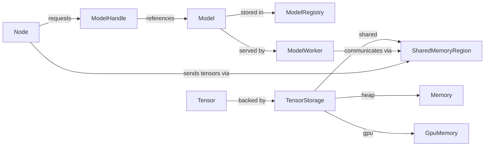
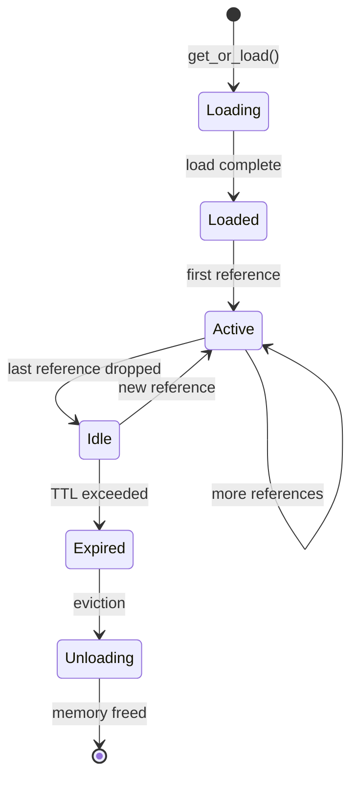
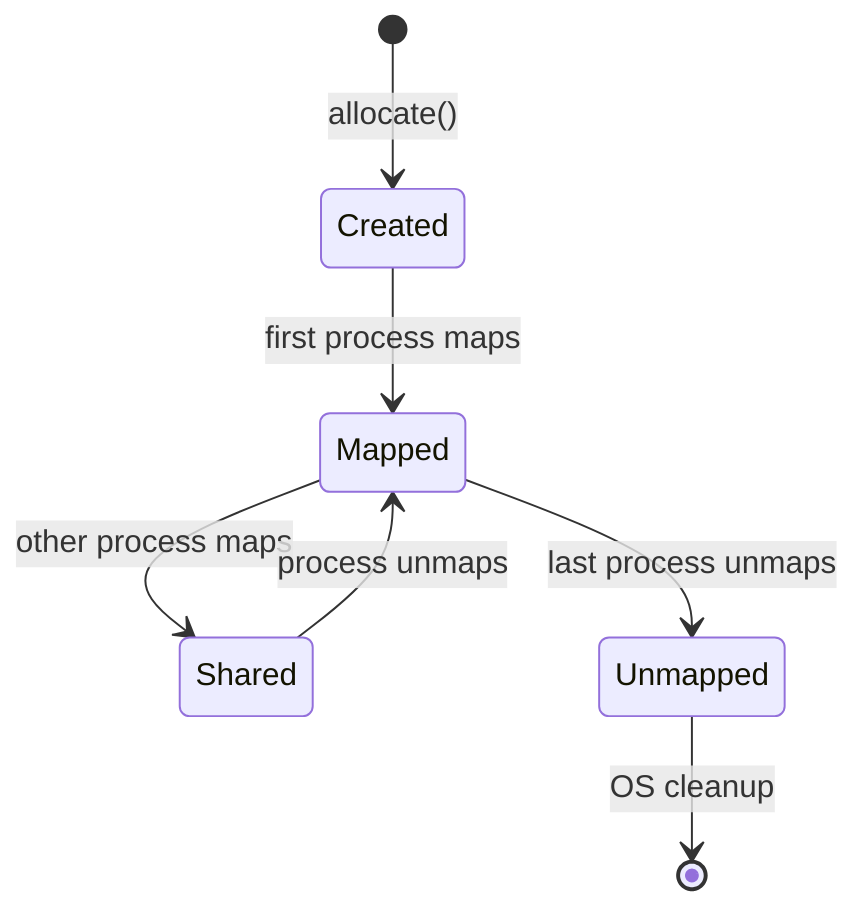

# Data Model: Model Registry and Shared Memory Tensors

**Feature**: Model Registry and Shared Memory Tensors  
**Date**: 2025-01-08  
**Status**: Complete

## Core Entities

### Model

Represents a loaded ML model with its weights and configuration.

**Fields**:
- `id: String` - Unique identifier (e.g., "lfm2_audio@cuda:0")
- `model_type: String` - Model architecture identifier
- `device: DeviceType` - CPU, CUDA, Metal, etc.
- `memory_usage: u64` - Bytes used by model weights
- `metadata: HashMap<String, String>` - Model-specific configuration
- `loaded_at: Timestamp` - When model was loaded
- `last_accessed: Timestamp` - Last inference request time
- `reference_count: AtomicU32` - Active handles to this model

**Invariants**:
- Model ID must be unique within a process
- Reference count must be >= 0
- Model cannot be unloaded while reference count > 0

### ModelHandle

A reference-counted handle to a loaded model.

**Fields**:
- `model_id: String` - References Model.id
- `inner: Arc<Model>` - Shared reference to model
- `session_id: Option<String>` - Optional session association

**Lifecycle**:
- Created by ModelRegistry.get_or_load()
- Cloning increments reference count
- Dropping decrements reference count
- Last drop triggers cleanup check

### SharedTensor

A tensor that can be backed by different storage mechanisms.

**Fields**:
- `data: TensorStorage` - Storage backend
- `shape: Vec<usize>` - Tensor dimensions
- `dtype: DataType` - f32, f16, i32, etc.
- `strides: Vec<usize>` - Memory layout
- `device: DeviceType` - Where tensor resides

**Storage Types**:
```rust
enum TensorStorage {
    Heap(Vec<u8>),                    // Standard heap allocation
    SharedMemory {
        region_id: String,             // SHM region identifier
        offset: usize,                 // Offset within region
        size: usize,                   // Tensor size in bytes
    },
    GpuMemory {
        device_ptr: *mut c_void,       // GPU memory pointer
        device_id: u32,                // GPU device index
    },
}
```

### SharedMemoryRegion

A memory region accessible by multiple processes.

**Fields**:
- `id: String` - Unique region identifier (UUID)
- `size: usize` - Total region size in bytes
- `created_by: ProcessId` - Creator process
- `created_at: Timestamp` - Creation time
- `access_mode: AccessMode` - ReadOnly, ReadWrite
- `reference_count: AtomicU32` - Processes using this region

**Platform Mapping**:
- Linux: `/dev/shm/{id}`
- Windows: `Global\\{id}`
- macOS: `mmap` with `MAP_SHARED`

### ModelWorker

A process that owns a model and serves inference requests.

**Fields**:
- `worker_id: String` - Unique worker identifier
- `model_id: String` - Model this worker serves
- `endpoint: String` - gRPC/IPC endpoint
- `status: WorkerStatus` - Starting, Ready, Busy, Stopping
- `current_load: u32` - Active requests
- `max_batch_size: u32` - Batching configuration
- `health_check_url: String` - Liveness endpoint

**States**:
```
Starting -> Ready -> Busy -> Ready -> Stopping -> Terminated
              ↑         ↓
              └─────────┘
```

### ModelRegistry

Process-local registry maintaining loaded models.

**Fields**:
- `models: RwLock<HashMap<String, Arc<Model>>>` - Loaded models
- `loading: Mutex<HashSet<String>>` - Models being loaded
- `config: RegistryConfig` - TTL, eviction policy, limits
- `metrics: RegistryMetrics` - Hit/miss rates, memory usage

**Operations**:
- `get_or_load(key, loader)` - Get existing or load new
- `release(key)` - Decrement reference count
- `evict_expired()` - Remove models past TTL
- `clear()` - Force unload all models

## Relationships



## State Transitions

### Model Lifecycle



### SharedMemoryRegion Lifecycle



## Validation Rules

### Model Loading
- Model size must not exceed available memory
- Device must be available (GPU present if cuda specified)
- Model ID must be unique within registry
- Concurrent loads of same model ID serialize to single load

### Shared Memory Allocation
- Size must not exceed system limits (`/proc/sys/kernel/shmmax` on Linux)
- Total SHM per session must not exceed quota
- Region ID must be globally unique (UUID v4)
- Cleanup must occur within TTL after last reference

### Tensor Operations
- Shape and dtype must match between source and destination
- Shared memory tensors require compatible layout (C-contiguous)
- Zero-copy requires aligned memory (platform-specific)
- GPU tensors require same device for zero-copy

## Access Patterns

### Read-Heavy Registry
- Multiple threads reading same model (99% case)
- RwLock allows concurrent reads
- Brief write lock only for insert/remove

### Write-Once Tensors
- Tensors written once, read many times
- Immutable after creation (COW semantics)
- Shared memory regions mapped read-only in consumers

### Batch Aggregation
- Workers collect requests until batch full or timeout
- Amortize model execution overhead
- Return individual results to callers

## Migration Considerations

### From Existing RuntimeData
- Extend `RuntimeData::Tensor` with storage field
- Default to heap storage for backward compatibility
- Detect SHM capability at runtime

### Python Integration
- `__array_interface__` for NumPy compatibility
- `__dlpack__` for PyTorch/TensorFlow
- Automatic conversion based on available protocol

## Performance Characteristics

| Operation | Complexity | Typical Time |
|-----------|------------|--------------|
| Registry lookup | O(1) | <1μs |
| Model first load | O(model_size) | 1-10s |
| Model cached access | O(1) | <100μs |
| SHM allocation | O(size) | <1ms per MB |
| SHM mapping | O(1) | <100μs |
| Tensor zero-copy | O(1) | <10μs |
| Reference counting | O(1) | <1μs |

## Capacity Planning

### Memory Requirements
- Registry overhead: ~1KB per model entry
- Handle overhead: ~100 bytes per handle
- SHM metadata: ~4KB per region
- Suggested limits:
  - Max 100 models per process
  - Max 10GB SHM per process
  - Max 1000 concurrent handles

### Monitoring Metrics
- `model_registry_hits` - Cache hit count
- `model_registry_misses` - Cache miss count
- `model_registry_memory_bytes` - Total memory used
- `shm_regions_active` - Active SHM regions
- `shm_bytes_allocated` - Total SHM allocated
- `tensor_zero_copy_count` - Successful zero-copy operations
